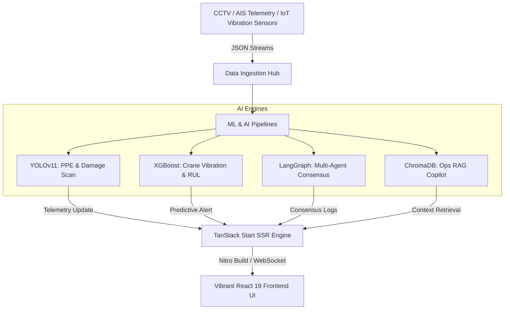

# Portmind AI — Real-Time Maritime & Logistics Intelligence Operating System

<div align="center">

[](https://vitejs.dev/)
[](https://reactjs.org/)
[](https://www.typescriptlang.org/)
[](https://tailwindcss.com/)
[](https://tanstack.com/)

**An ultra-responsive, real-time command, control, and multi-agent coordination system for modern maritime terminals and container logistics hubs.**
</div>

---

## 📖 Table of Contents
- [🌐 Project Vision](#-project-vision)
- [📦 System Modules & Key Features](#-system-modules--key-features)
- [🧩 Architecture & Orchestration Mesh](#-architecture--orchestration-mesh)
- [🛠️ Technology Stack](#%EF%B8%8F-technology-stack)
- [⚙️ Setup & Local Installation](#%EF%B8%8F-setup--local-installation)
- [📁 Project Directory Structure](#-project-directory-structure)
- [🗺️ Routing & Server Architecture](#%EF%B8%8F-routing--server-architecture)
- [🤝 Contribution Guidelines](#-contribution-guidelines)

---

## 🌐 Project Vision

Portmind AI bridges the gap between raw physical telemetry and structured operator consensus. By integrating computer vision (YOLOv11), predictive modeling (XGBoost), agent coordination schemas (LangGraph), and semantic retrieval (ChromaDB RAG), Portmind AI converts real-time camera feeds, AIS telemetry, and crane IoT vibrations into millisecond-level decision flows. 

Whether preventing high-risk PPE violations, scheduling berth arrivals for massive cargo vessels, or resolving crane duty cycles through dynamic load sharing, Portmind AI provides operators with a unified, state-of-the-art terminal operating panel.

---

## 📦 System Modules & Key Features

### 1. 📺 Command Center
* **Live Operational Metrics**: Continuous monitoring of Active Vessels, Daily Container Throughput, active Safety Alerts, and Fleet Crane Health.
* **Risk Score Matrix**: Auto-calculates Global Port Risk Score using a composite index of 47 live signals (Equipment health, safety rules, weather hazards).
* **Dynamic Event Streams**: Real-time auto-updating logs signaling yard OCR detection, berth arrivals, and maintenance warnings.

### 2. 🗺️ Live 2D/3D Digital Twin Map
* **Interactive Spatial Layout**: Live tracking and coordinates of container blocks, gate lanes, berths, quay walls, and equipment.
* **Smart Heatmaps**: Toggleable visual layers showing yard fill percentage, queue congestions, and operational density.
* **Inspectable Entities**: Click to detail mechanical status, current cargo load, speed, and positioning details for cranes, vessels, and trucks.

### 3. ⚔️ Multi-Agent Collaborative War Room
* **Autonomous Agent Mesh**: Features Marine Traffic, Yard Allocation, Crane Dispatch, and Gate Coordination agents communicating in a dynamic consensus loop.
* **Consensus DAG Visualizer**: Flow animations depicting active message passes and token coordination between micro-agents.
* **Conflict Arbitration Board**: Lists resolving/resolved operational bottlenecks (e.g., crane vibration limits throttling discharge speed vs. yard loading requirements).

### 4. 📦 Container Intelligence
* **OCR Shipping Identification**: Alphanumeric scanning and registration of container IDs in real time.
* **Structural Scanning**: Structural integrity scanning for side impacts, container corrosion, or top-flange damage.
* **Yard Matrices**: Coordinates positioning maps to optimize crane stack allocation.

### 5. 🏗️ Predictive Asset Maintenance
* **Remaining Useful Life (RUL)**: Live vibration sensors feed XGBoost models to evaluate mechanical wear.
* **Early Failure Alarms**: Automatically flags abnormal telemetry (e.g., crane vibration spike exceeding 4g threshold) and schedules service runs.

### 6. 🛰️ Vessel Intelligence
* **Real-time AIS Telemetry**: Forecasts vessel Estimated Time of Arrival (ETA) dynamically based on channel congestion and weather parameters.
* **Berth Optimization**: Algorithmic berthing allocation based on vessel size and crane dispatch workload.

### 7. 🛡️ Safety & PPE Compliance
* **Vision Guardrails**: PPE detection scanning for helmet/vest compliance, hazardous zone breaches, and unauthorized entries.
* **Intrusion Mitigation**: Instantly alerts safety dispatchers and maps physical coordinates of infractions.

### 8. 🧠 AI Copilot & Docs AI
* **Natural Language Operator**: RAG query hub parsing port rules, harbor operations handbook, and shipping protocols.
* **Action Automation**: Multi-agent orchestration maps operator questions to operational APIs.

---

## 🧩 Architecture & Orchestration Mesh



---

## 🛠️ Technology Stack

| Component | Technology | Description |
|---|---|---|
| **Core Client Framework** | React 19, TypeScript, Vite | Ultra-responsive state reconciliation and module bundle compiling. |
| **Server Engine** | TanStack Start (Vinxi, Nitro) | Performance-oriented file-based routing, SSR, and API middleware. |
| **Styling Systems** | Tailwind CSS v4, Vanilla CSS | Next-gen utility-first styling with modern dark theme tokens. |
| **Visualizations** | Recharts, SVG layouts | Multi-layered SVG grids, area charts, line maps, and radar diagrams. |
| **Animations** | Framer Motion | Fluid micro-interactions, layout morphing, and consensus DAG animations. |
| **Icons Library** | Lucide React | High-quality, modern stroke-based iconography. |

---

## ⚙️ Setup & Local Installation

### Prerequisites
* **Node.js**: `v20.0.0` or higher.
* **NPM**: Package manager (comes bundled with Node).

### Installation Steps

1. **Clone the Repository**:
   ```bash
   git clone https://github.com/Aryanbuha890/Portmind-AI-Hacknomics.git
   cd portmind-ai-main
   ```

2. **Enter the Frontend workspace**:
   ```bash
   cd Frontend
   ```

3. **Install Dependencies**:
   ```bash
   npm install
   ```

4. **Launch Local Development Server**:
   ```bash
   npm run dev
   ```
   *The client app compiles synchronously and launches on [http://localhost:8080/](http://localhost:8080/).*

5. **Build for Production**:
   ```bash
   npm run build
   ```
   *Generates performance-optimized static pages and Nitro server handler artifacts.*

6. **Run Code Formatter**:
   ```bash
   npm run format
   ```

7. **Run Code Linter**:
   ```bash
   npm run lint
   ```

---

## 📁 Project Directory Structure

```text
portmind-ai-main/
├── Frontend/                           # Frontend application module
│   ├── src/
│   │   ├── components/                 # Shared React UI components
│   │   │   ├── ui/                     # Radix UI / Atomic design tokens
│   │   │   ├── AppSidebar.tsx          # Master navigation panel
│   │   │   ├── AnimatedCounter.tsx     # Performance dynamic number counters
│   │   │   └── Logo.tsx                # Corporate branding component
│   │   ├── hooks/                      # Custom React logic hooks
│   │   ├── lib/                        # Operational utilities and error capturing
│   │   │   ├── error-capture.ts        # Global client/SSR exception traps
│   │   │   └── error-page.ts           # Fallback error recovery screen
│   │   ├── routes/                     # TanStack Start File-based Routing
│   │   │   ├── __root.tsx              # Root HTML Shell and provider context
│   │   │   ├── index.tsx               # High-fidelity Home/Landing page
│   │   │   ├── app.tsx                 # Core App Shell layout wrapper
│   │   │   ├── auth.tsx                # User Session validation gateway
│   │   │   ├── auth/                   # Authentication Route Directory
│   │   │   │   ├── login.tsx           # Session login interface
│   │   │   │   ├── signup.tsx          # New operator registration portal
│   │   │   │   ├── forgot-password.tsx # Password recovery panel
│   │   │   │   └── reset-password.tsx  # Dynamic credential updating
│   │   │   └── app/                    # Primary Command & Operations Dashboard
│   │   │       ├── index.tsx           # Operator Command Center
│   │   │       ├── analytics.tsx       # Live operational analytics & KPIs
│   │   │       ├── containers.tsx      # Container intelligence & OCR scan log
│   │   │       ├── cranes.tsx          # Crane predictive health & vibration telemetry
│   │   │       ├── decision-center.tsx # Operator action triggers and priority control
│   │   │       ├── digital-twin.tsx    # SVG interactive digital twin grid map
│   │   │       ├── war-room.tsx        # Multi-agent consensus DAG room
│   │   │       ├── safety.tsx          # PPE compliance & zone violation scanner
│   │   │       ├── copilot.tsx         # Operator interactive AI Chat assistant
│   │   │       ├── docs-ai.tsx         # Semantic harbor rulebook RAG query portal
│   │   │       ├── emergency.tsx       # Emergency protocol dispatcher
│   │   │       ├── simulator.tsx       # Weather & cargo surge simulator
│   │   │       ├── predictions.tsx     # ML analytics model predictor playground
│   │   │       ├── executive.tsx       # High-level executive monitoring stats
│   │   │       ├── settings.tsx        # Control panel settings
│   │   │       └── vessels.tsx         # Live AIS telemetry berth allocation mapping
│   │   ├── styles.css                  # Core design system and Tailwind custom directives
│   │   ├── router.tsx                  # TanStack Route registration configuration
│   │   ├── server.ts                   # Nitro server-side entry handler
│   │   └── start.ts                    # Client entry compiler bootstrap
│   ├── eslint.config.js                # ESLint code standard rules
│   ├── package.json                    # Package manifest and build scripts
│   └── vite.config.ts                  # Vite compile config with TanStack plugins
├── README.md                           # Main developer documentation (this file)
└── .gitignore                          # Exclusions manifest
```

### Clickable File Index

* **Root Navigation**:
  * [router.tsx](file:///d:/Github%2026%20NEW/portmind-ai-main/Frontend/src/router.tsx) — Main client route registry.
  * [server.ts](file:///d:/Github%2026%20NEW/portmind-ai-main/Frontend/src/server.ts) — Server SSR entry wrapper.
  * [start.ts](file:///d:/Github%2026%20NEW/portmind-ai-main/Frontend/src/start.ts) — Client entry compiler.
  * [package.json](file:///d:/Github%2026%20NEW/portmind-ai-main/Frontend/package.json) — NPM dependencies and build script manifests.

* **Core Layouts & Shells**:
  * [routes/__root.tsx](file:///d:/Github%2026%20NEW/portmind-ai-main/Frontend/src/routes/__root.tsx) — Base HTML document provider context.
  * [routes/index.tsx](file:///d:/Github%2026%20NEW/portmind-ai-main/Frontend/src/routes/index.tsx) — Home landing page.
  * [routes/app.tsx](file:///d:/Github%2026%20NEW/portmind-ai-main/Frontend/src/routes/app.tsx) — Authenticated app wrapper.
  * [components/AppSidebar.tsx](file:///d:/Github%2026%20NEW/portmind-ai-main/Frontend/src/components/AppSidebar.tsx) — Side panel control navigation.

* **Operations Dashboard Modules**:
  * [app/index.tsx](file:///d:/Github%2026%20NEW/portmind-ai-main/Frontend/src/routes/app/index.tsx) — Live operator command center.
  * [app/digital-twin.tsx](file:///d:/Github%2026%20NEW/portmind-ai-main/Frontend/src/routes/app/digital-twin.tsx) — Interactive SVG maps and entities tracking.
  * [app/war-room.tsx](file:///d:/Github%2026%20NEW/portmind-ai-main/Frontend/src/routes/app/war-room.tsx) — Multi-agent consensus logs & DAG.
  * [app/containers.tsx](file:///d:/Github%2026%20NEW/portmind-ai-main/Frontend/src/routes/app/containers.tsx) — Container intelligence tracker.
  * [app/cranes.tsx](file:///d:/Github%2026%20NEW/portmind-ai-main/Frontend/src/routes/app/cranes.tsx) — Predictive crane mechanical diagnostic feeds.
  * [app/vessels.tsx](file:///d:/Github%2026%20NEW/portmind-ai-main/Frontend/src/routes/app/vessels.tsx) — AIS vessel list & berth assignment tracking.
  * [app/safety.tsx](file:///d:/Github%2026%20NEW/portmind-ai-main/Frontend/src/routes/app/safety.tsx) — PPE and boundary compliance.
  * [app/copilot.tsx](file:///d:/Github%2026%20NEW/portmind-ai-main/Frontend/src/routes/app/copilot.tsx) — Operator AI assistant interface.
  * [app/docs-ai.tsx](file:///d:/Github%2026%20NEW/portmind-ai-main/Frontend/src/routes/app/docs-ai.tsx) — Rulebooks semantic RAG dashboard.
  * [app/decision-center.tsx](file:///d:/Github%2026%20NEW/portmind-ai-main/Frontend/src/routes/app/decision-center.tsx) — Action prioritization panel.

---

## 🗺️ Routing & Server Architecture

Portmind AI leverages **TanStack Start**'s file-based routing architecture. 

* **State Synchronization**: Client-side state transitions are managed declaratively under [router.tsx](file:///d:/Github%2026%20NEW/portmind-ai-main/Frontend/src/router.tsx).
* **Static / SSR Splitting**: Route templates in `Frontend/src/routes/` are split using Vinxi during compilation, serving highly optimized HTML shells and hydrated Javascript.
* **Error Containment**: Global boundary trapping in [error-capture.ts](file:///d:/Github%2026%20NEW/portmind-ai-main/Frontend/src/lib/error-capture.ts) intercepts runtime rendering crashes and handles Nitro SSR recovery smoothly without dropping active operator sessions.
